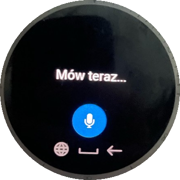
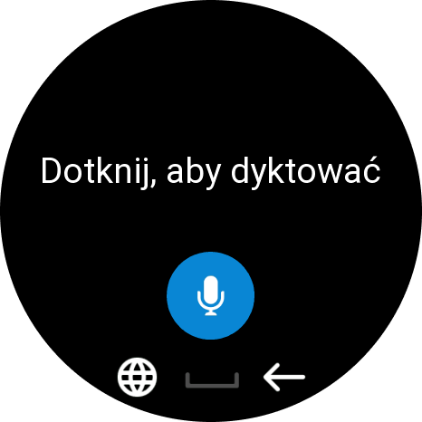
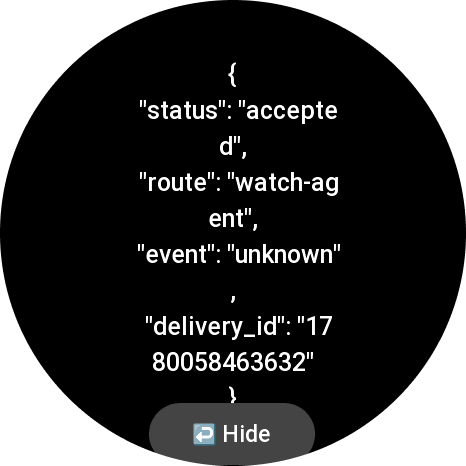

# Voice Bridge

A simple Zepp OS app that lets you dictate a message on your Amazfit watch and send it as a JSON webhook to any endpoint you want.

## What It Does

You speak into the watch, the text gets transcribed, and the app sends it as an HTTP POST to a URL you configure — that's it.

Works with anything that accepts a webhook: **n8n**, **Zapier**, **Make**, **Home Assistant**, **OpenAI**, **Claude**, **Slack bots**, or your own API.

## Screenshots

<p align="center">
  
  
  
</p>

## How It Works

```
Voice Input → Transcription → JSON POST → Your Endpoint
  (watch)      (Zepp OS STT)   (via phone)   (anywhere)
```

The watch captures speech, Zepp OS converts it to text, and the app sends it through BLE to the paired phone, which delivers the HTTP request.

## Setup

1. Install Voice Bridge on your Amazfit watch
2. Open the app settings in the Zepp App on your phone
3. Set your **Endpoint URL** and optional **Authorization** header
4. Launch Voice Bridge on the watch and start talking

> **Tip:** Assign Voice Bridge to a hardware shortcut (e.g. double-press the bottom button). This way you can quickly capture a thought on the go — press, speak, done.

## Configuration

| Setting | Description |
|---------|-------------|
| **Endpoint URL** | Your webhook or API endpoint |
| **Authorization** | Full auth header value (`Bearer xxx`, `Basic yyy`, or empty) |
| **JSON Key** | Field name for the text payload (default: `message`) |
| **Sender ID** | Optional sender label in the payload |

## Request Format

```json
{
  "message": "Buy milk and bread",
  "sender": "watch-user"
}
```

Both the field name and sender are configurable.

## HTTP response semantics

The watch treats a delivery as **successful** when the HTTP status code is **less than 400** (any **2xx** or **3xx**). Codes **4xx** and **5xx** show an error on screen with the status code. If the runtime omits `status`, the app assumes **200** (success).

| Condition | Watch UI |
|-----------|----------|
| Status &lt; 400 | **Sent** (green), short vibration |
| Status ≥ 400 | **Error {code}** (4xx red / 5xx orange), Try again |
| No status in response | Treated as **200** (success) |
| Network failure / timeout | **No connection**, code `NET` |
| Non-standard body with `"ok":true` or `runid` (no status) | **Sent**, code `UNK` (heuristic) |

- **Request timeout:** 10 seconds (`HTTP_TIMEOUT_MS` in `page/index.js`).
- **Transport:** JSON POST goes through the paired phone (BLE). Use **HTTPS** on your endpoint; the app does not add encryption beyond TLS on the URL you configure. Plain **HTTP** is allowed but shown with a security warning in Zepp App settings.

## ZAB package validation

After `bun run build`, verify the `.zab` archive before sideload or store upload:

```bash
./verify-zab.sh dist/1106856-Voice_Bridge-*.zab
```

The script fails if `manifest.json` or `assets/icon.png` (124×124 device menu icon) is missing inside the package.

## Requirements

- Amazfit watch running **Zepp OS 3.0+** (API Level 4.0)
- Zepp App on paired phone
- Tested on: Amazfit Active 2 NFC

## Privacy

No analytics, no tracking, no telemetry. All data goes directly to the endpoint you configure. See [Privacy Policy](PRIVACY_POLICY.md).

## License

MIT
